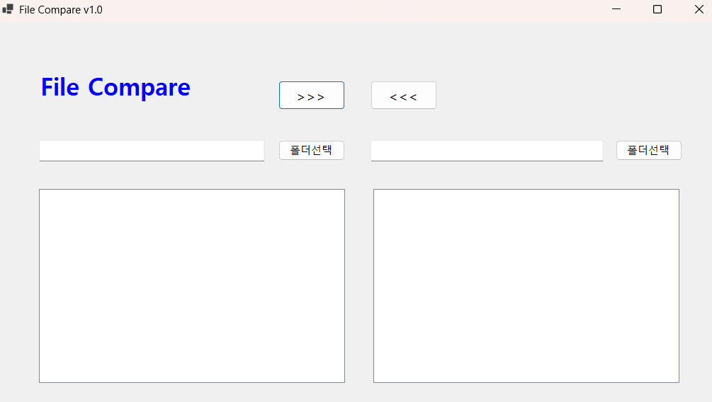
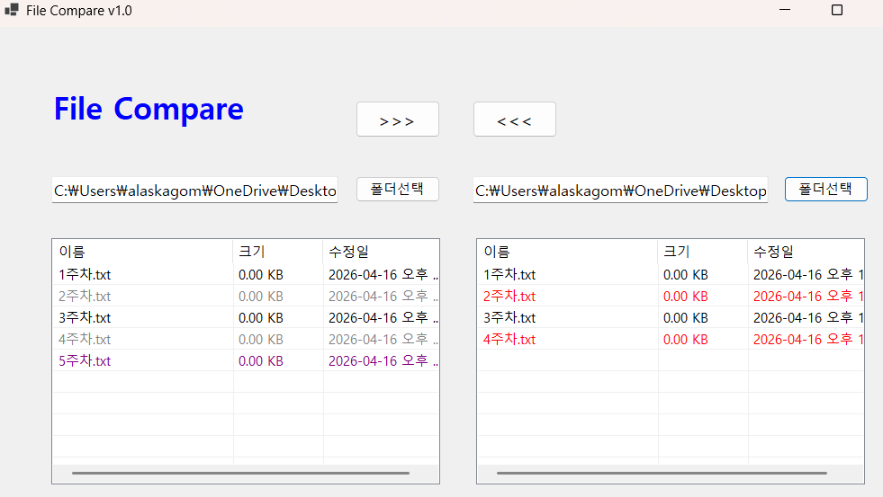

# (C# 코딩) 파일 비교툴(FileCompare)

## 개요
-C# 프로그래밍학습  
-1줄소개: 파일을 비교하는 앱  

-사용한플랫폼:C#, .NET Windows Forms, Visual Studio, GitHub  

-사용한컨트롤:SplitContainer, Panel, ListView, button, textbox, Label

-구현한기능  
파일 비교 및 상태 표시  
선택 파일 복사 및 덮어쓰기 처리 가능  
파일 비교 결과를 색상으로 표시  
선택한 파일 강조  
(>>>, <<<) 버튼 클릭시 선택한 방향으로 파일 복사 가능

## 실행화면(과제1)
-과제1코드의실행스크린샷

-과제내용  
사용자가 두 폴더의 파일을 직관적으로 비교하고 관리할 수 있도록 기본적인 인터페이스(UI)를 설계하고, 창 크기 변화에 대응하는 유연한 레이아웃을 구축

-구현내용과 기능설명  
메인 타이틀: Label 컨트롤을 사용하여 앱 이름("File Compare")을 상단에 표시  
경로 입력창: TextBox 2개를 배치하여 선택된 폴더의 절대 경로가 표시되도록 설정   
폴더 선택 버튼: 각 텍스트박스 옆에 Button을 배치하여 폴더 브라우저 창을 띄울  준비를 함.  
중앙 기능 버튼: 리스트뷰 사이에 >>>, <<< 버튼을 배치하여 향후 복사 기능을 실행할 공간 확보.  
ListView: Top, Bottom, Left, Right 네 방향 앵커를 모두 설정하여 창과 함께 커지도록 구현.  
우측 버튼 및 텍스트박스: Top, Right 앵커를 설정하여 창이 가로로 넓어질 때 우측 정렬을 유지하도록 구현.  

## 실행화면(과제2)
-과제2코드의실행스크린샷

-과제내용  
사용자가 선택한 두 폴더의 내용을 읽어와 리스트뷰에 표시하고, 파일명과 수정 시간을 비교하여 동일, 최신(New), 이전(Old), 단독 존재 상태를 판별해 서로 다른 색상으로 출력

-구현내용과기능설명  
폴더 선택 기능: FolderBrowserDialog를 사용하여 왼쪽과 오른쪽 폴더 경로를 각각 가져옴  
리스트뷰 설정: View = Details 모드에서 '이름', '크기', '수정일' 컬럼을 구성  
검은색 (Black): 양쪽 폴더에 파일이 모두 있고, 수정 시간도 동일한 경우  
빨간색 (Red): 반대편 폴더의 파일보다 수정 시간이 더 최신인 경우 (New)  
회색 (Gray): 반대편 폴더의 파일보다 수정 시간이 오래된 경우 (Old)  
보라색 (Purple): 한쪽 폴더에만 존재하고 반대편에는 없는 경우 (단독 파일)

## 실행화면(과제3)
-과제3코드의실행스크린샷

-과제내용

-구현내용과기능설명
  

## 실행화면(과제4)
-과제4코드의실행스크린샷

-과제내용
 

-구현내용과기능설명
   